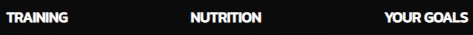
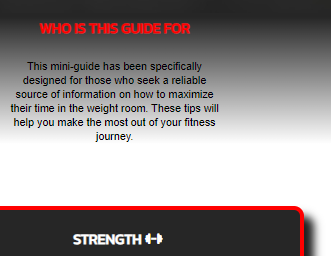

# Fabrizio's Milestone Project 1 

### The Strategy Plane

With this first project I wanted to address a topic that I have been researching on my own in the last years. The topic in question is Sport's Science. In particular my goal was to create a three page website that could serve as a blueprint for the users when they faced situation where they had to make a decision regarding their diet or their time in the weight room. The target audience that I wanted to attract was heterogeneous in nature and it encompassed a wide spectrum of age.

### The Scope Plane

In order to best convey the information within the website I decided to include a simple and visually clear layout and website design. The main features used are a sectioned content divided in two main pages and a third page dedicated to user interaction. 

### The Structure Plane

I wanted to place the information within the website to have a logical order the better suited the message that was on each respective page. To achieve this I used the first page to display the content about resistance training. This prioritization was based on the fact that in a real world application putting the gym first, (in respects to the duality of diet and gym) would yield better results. The second page shows the nutrition related informations, while the third page is reserved to forms.

### The Skeleton Plane

The representation of the various content has been spread over two pages of information and one of interaction to allow the user to completely focus on one topic at a time. I organized the resistance training and nutrition page similarly to create a sense a familiarity which would allow the user to rely on redundancy of visualization to make the UX not overwhelming. I used a fixed navigation bar on top of the page for a quick accessibility to the whole website and a initial hero image and description as a minamalist but inpactful welcome. In the main section of both pages the content is alternated with descriptive or high quality images that assist in relaying the message. The footer section in the three pages is styled with a thought of semplicity and clarity.

### The Surface Plane

The principal choices that characterize the website style are the image used and the colors. In the resistance training page I used a hero image that would maintain semplicity and minimalism while also showing a somewhat aggressive set of colors that would inspire action. The other three images in the page are strongly related to the "content-box" on their side. I did this with a information-reinforcement in mind. For the Nutrition page I used a hero image that would allow the user to immediately understand the type of environment that the page would provide. All the "content-boxes" have effects which enable the user to focus and center the attention on the respective information displayed. I alternated between rounded and sharp corners between images and containers to facilitate readability and give the pages a look that wasn't too rigid.

## The User Story

As previously stated this website is being proposed as a quick access mini-guide to a wide variety of people. The information address a well known need for first time gym goers or all those who intend to embark on a specific type of diet journey. The user would land on the first page that is dedicated to training only. Although this might be confusing for someone who is looking for diet related advice, the evident navigation bar makes it very easy to access the following page. The nutrition content is structured in the second page because within the hierarchy of body recomposition priorities training comes first and it is usually the first topic researched by beginners. The second page content is layed out similarly to the first page. This is to make the information readily available and to maintain readability in both pages. Once on the second page the user could also decide to opt to visit the third page. This last interaction would bring him to two forms designed to prompt the user to subscribe and to share their gym or diet goals. 

## Fonts, Colors and Style Choices

Behind the styling choices there is a very simple reasoning. What I aimed to create was a simple website which would focus more on information and that would cut away most of the unecessary distractions. I chose the headings and paragraphs fonts because they conveyed the message in a modern and readable fashion at different screen sizes. The color palette used is as follows: 

## Features Used

I tried to maintain the website in a streamlined look to enhance a direct message and to avoid animations and other interactions that could have distracted the user.

### Navigation Bar

This navigation bar has been created for immediate use and to remain familiar and of easy access at different screen widths. High contrast and fixed position make this interaction quick and ready at all times.

### Content Features

This image shows the introduction section. Placed immediately after the header, provides the information needed to understand the content of the page. The red border and shadow on the bottom of the image is common for all content containers. It transforms red upon hovering and it is designed to focus the user on the selected element.

### Footer Links

As a commonality among many website, the social media links are placed, well identified and visible, at the bottom of the page. The reason for this is obviously to take advantage of most common practices shared by most modern layouts and web pages.

## Tech Used

The two main technologies used in this project are HTML5 and CSS. Alongside I have used other tools that I have implemented in my process. The website was built using the following technologies:

[Coolors for the color palette](https://coolors.co/)

[CloudConvert to change the file format of the images](https://cloudconvert.com/)

[GitPod as the main text editor and IDE](https://gitpod.io/)

[GitHub as the repository base and to deploy the finished website](https://github.com/)

[Google Fonts as a source for the fonts I used](https://fonts.google.com/?hl=it)

## Bugs

During the process for the creation of this website I've had to correct several bugs. The vast majority of these bugs were in the media queries and in the responsive related code in the css file. For the most part I was able to solve the problem through the correction of some value that displayed in a fixed format, like pixels. By switching to a more adaptive value like percentages or viewport width I was able to restore the responsiveness for the various screen widths.

## Future Development

For obvious reasons a three page website about sport's science is not an exhaustive source of information. The implementation for this project will surely have to be made on the content. A further breakdown of the concepts is needed, as well as in-depth look into the single topics that would arise. With the addition of more information I would advice an improvement of the navigation options to allow the user for a much easier search within the website's pages. In light of the recent progress in machine learning and A.I. it would be wise to implement free tools for calorie tracking and customizable templates for training plans. These updates would certainly drive the user to a much higher number of interactions and a longer engagement time on the website.

## Credit

[For some of the images in this website I have used Pexels](https://www.pexels.com/it-it/)

[For other images I have used Unsplash](https://unsplash.com/it)

[In order to better understand the property of "display:flex;" I have used Kevin Powell's YouTube channel](https://www.youtube.com/@KevinPowell)
